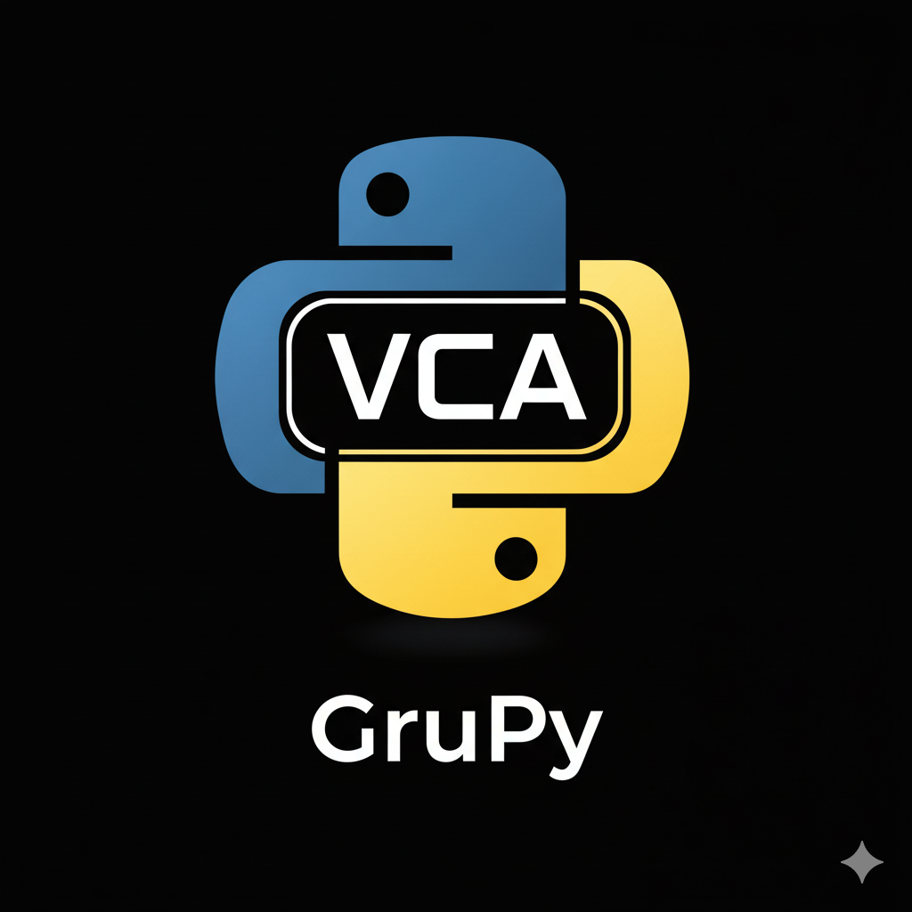
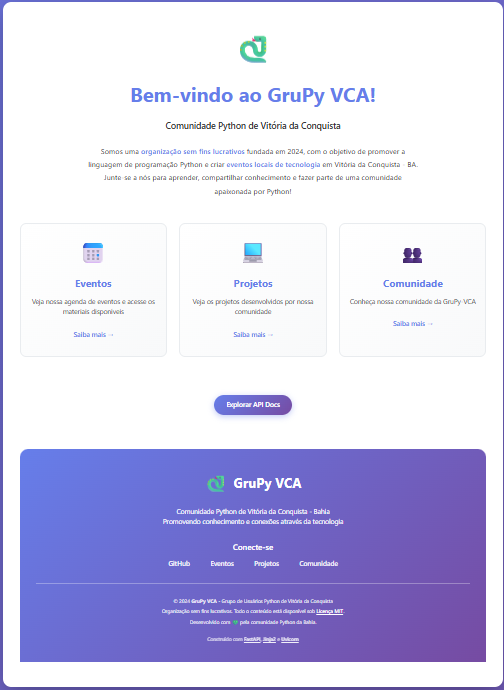

# Landing Page - GruPy VCA

<p align="center">
  
</p>

<p align="center">
  <strong>Comunidade Python de Vitória da Conquista - Bahia</strong>
</p>

<p align="center">
  <a href="#sobre">Sobre</a> •
  <a href="#-funcionalidades">Funcionalidades</a> •
  <a href="#-screenshots">Screenshots</a> •
  <a href="#tecnologias-utilizadas">Tecnologias</a> •
  <a href="#instalação">Instalação</a> •
  <a href="#-acessibilidade">Acessibilidade</a> •
  <a href="#contribuição">Contribuição</a>
</p>

---

## Sobre

A GruPy-VCA é a comunidade de Python de Vitória da Conquista - BA.

Este projeto é a **landing page oficial da comunidade GruPy-VCA**, desenvolvida para divulgar informações sobre o grupo, conectar membros da comunidade e servir como ponto de encontro digital para entusiastas de Python na região.

A aplicação é construída como uma **API web moderna** que renderiza páginas HTML dinâmicas, integra-se com a API do GitHub para exibir informações da comunidade e serve como base para futuros recursos da plataforma.

## ✨ Funcionalidades

- 🏠 **Página Inicial**: Landing page atrativa com informações sobre a comunidade
- 👥 **Página de Comunidade**: Galeria de membros com fotos e links para redes sociais (GitHub, LinkedIn, Instagram)
- 🔍 **Busca de Perfil GitHub**: Consulta e exibição detalhada de perfis do GitHub em tempo real
- 📅 **Eventos** (em desenvolvimento): Agenda de meetups, workshops e palestras
- 💻 **Projetos** (em desenvolvimento): Showcase de projetos open source da comunidade
- ♿ **100% Acessível**: Conformidade WCAG 2.1 Nível AA para inclusão de pessoas com deficiência
- 🎨 **Design Moderno**: Interface responsiva e intuitiva com animações suaves
- 🚀 **Alta Performance**: Carregamento rápido e otimizado

### Estrutura do Projeto

```
landingpage/
├── src/                    # Código-fonte da aplicação
│   ├── app.py             # Arquivo principal com rotas e lógica da aplicação
│   ├── templates/         # Templates HTML com Jinja2
│   ├── static/            # Arquivos estáticos (CSS, JavaScript)
│   │   ├── css/          # Folhas de estilo
│   │   └── js/           # Scripts JavaScript
│   └── __pycache__/      # Cache do Python (gerado automaticamente)
├── pyproject.toml         # Configuração do projeto e dependências
├── uv.lock               # Lock file com versões exatas das dependências
├── .python-version       # Versão do Python usada no projeto
└── README.md             # Este arquivo
```

**Arquivos de Configuração:**
- **`pyproject.toml`**: Define metadados do projeto, dependências e requisitos de versão do Python
- **`.python-version`**: Especifica a versão do Python para ferramentas como pyenv
- **`uv.lock`**: Garante instalações reproduzíveis ao travar versões de dependências

## 📸 Screenshots

### Página Inicial
Interface principal da comunidade com informações sobre o GruPy VCA, cards de funcionalidades e busca de perfil do GitHub.

<p align="center">
  
</p>

### Página de Comunidade
Galeria com todos os membros da comunidade, exibindo foto, nome, cargo e links para redes sociais.

<p align="center">
  
</p>

### Páginas em Desenvolvimento
Template elegante para páginas que ainda estão sendo construídas pela comunidade.

<p align="center">
  
</p>

### Tecnologias Utilizadas

#### FastAPI
[FastAPI](https://fastapi.tiangolo.com/) é um framework web moderno e de alto desempenho para construir APIs com Python. Neste projeto, é usado para:
- Criar rotas e endpoints da aplicação
- Gerenciar requisições HTTP
- Integrar com templates HTML
- Fazer requisições assíncronas para APIs externas (como GitHub)

#### Jinja2
[Jinja2](https://jinja.palletsprojects.com/) é um mecanismo de templates poderoso para Python. É usado para:
- Renderizar páginas HTML dinâmicas
- Inserir dados do servidor nas páginas
- Reutilizar componentes HTML com herança de templates
- Criar layouts responsivos e interativos

#### Uvicorn
[Uvicorn](https://www.uvicorn.org/) é um servidor ASGI de alto desempenho. Serve para:
- Executar a aplicação FastAPI em ambiente de desenvolvimento
- Recarregar automaticamente o servidor quando há mudanças no código
- Servir a aplicação em produção com suporte a múltiplos workers

## Instalação

Este projeto utiliza Python **3.12 ou superior** e o gerenciador de pacotes **UV** para instalação rápida e eficiente de dependências.

### Pré-requisitos

Antes de começar, certifique-se de ter instalado:

#### Linux (Ubuntu/Debian)

1. **Atualizar pacotes do sistema:**
```bash
sudo apt update
sudo apt upgrade -y
```

2. **Instalar dependências do Python (opcional, caso compile o Python):**
```bash
sudo apt install -y build-essential libssl-dev zlib1g-dev \
libbz2-dev libreadline-dev libsqlite3-dev curl \
libncursesw5-dev xz-utils tk-dev libxml2-dev libxmlsec1-dev libffi-dev liblzma-dev
```

3. **Instalar Python 3.0:**
   
   **Opção A - Via apt (Ubuntu 24.04+):**
   ```bash
   sudo apt install python3.12 python3.12-venv
   ```

   **Opção B - Via pyenv (recomendado para gerenciar múltiplas versões):**
   ```bash
   # Instalar pyenv
   curl https://pyenv.run | bash
   
   # Adicionar ao ~/.bashrc ou ~/.zshrc
   echo 'export PYENV_ROOT="$HOME/.pyenv"' >> ~/.bashrc
   echo 'command -v pyenv >/dev/null || export PATH="$PYENV_ROOT/bin:$PATH"' >> ~/.bashrc
   echo 'eval "$(pyenv init -)"' >> ~/.bashrc
   
   # Recarregar o shell
   source ~/.bashrc
   
   # Instalar Python 3.12
   pyenv install 3.12
   pyenv global 3.12
   ```

4. **Instalar UV:**
```bash
curl -LsSf https://astral.sh/uv/install.sh | sh
```

#### Windows

1. **Instalar Python 3.12:**
   - Baixe o instalador do [site oficial do Python](https://www.python.org/downloads/)
   - Execute o instalador
   - ⚠️ **IMPORTANTE:** Marque a opção "Add Python to PATH" durante a instalação
   - Escolha "Install Now" ou "Customize Installation"

2. **Verificar instalação do Python:**
   ```cmd
   python --version
   ```
   Deve mostrar Python 3.12.x

3. **Instalar UV:**
   
   **Opção A - Via PowerShell (recomendado):**
   ```powershell
   powershell -c "irm https://astral.sh/uv/install.ps1 | iex"
   ```
   
   **Opção B - Via pip:**
   ```cmd
   pip install uv
   ```

### Configuração do Projeto

1. **Clone o repositório:**
```bash
git clone https://github.com/flaviofilipe/grupy_landingpage.git
cd landingpage
```

2. **Configure a versão do Python (se estiver usando pyenv):**
```bash
pyenv local 3.12
```

3. **Instale as dependências com UV:**
```bash
uv sync
```
Este comando irá:
- Criar um ambiente virtual automaticamente
- Instalar todas as dependências definidas no `pyproject.toml`
- Gerar/atualizar o arquivo `uv.lock`

### Executando o Projeto

Inicie o servidor de desenvolvimento:

```bash
uv run uvicorn src.app:app --reload
```

A aplicação estará disponível em: **http://localhost:8000**

**Opções úteis:**
- `--reload`: Recarrega automaticamente quando detecta mudanças no código
- `--host 0.0.0.0`: Permite acesso de outras máquinas na rede
- `--port 8080`: Altera a porta padrão

## Contribuição

Contribuições são muito bem-vindas! Este projeto é mantido pela comunidade e quanto mais pessoas contribuírem, melhor ele ficará.

Para instruções detalhadas sobre como contribuir, consulte o [Guia de Contribuição](CONTRIBUTING.md).

**Resumo rápido:**
1. Faça um fork do projeto
2. Clone para sua máquina
3. Crie uma branch para sua alteração
4. Faça suas modificações e teste
5. Commit e push das alterações
6. Abra um Pull Request

---

**Obrigado por contribuir com a GruPy-VCA! 🐍💚**

Se tiver dúvidas, abra uma [issue](https://github.com/flaviofilipe/grupy_landingpage/issues) ou entre em contato com a comunidade.